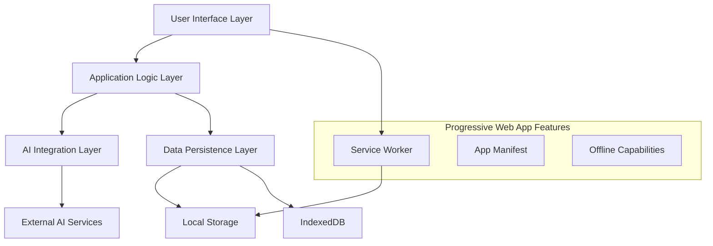

# Divine Devotion Research Paper - Writing Guidelines and Next Steps

## Writing Strategy and Timeline

### Phase 1: Foundation (Week 1-2)
**Immediate Actions:**
1. **Refine Research Questions**: Based on your specific research focus
2. **Expand Literature Review**: Add current, peer-reviewed sources
3. **Document Technical Details**: Capture implementation specifics
4. **Define Evaluation Metrics**: Establish measurable outcomes

### Phase 2: Data Collection (Week 3-4)
**Technical Analysis:**
1. **Performance Testing**: Comprehensive Lighthouse audits, load testing
2. **Code Quality Assessment**: Complexity analysis, maintainability metrics
3. **Accessibility Audit**: WCAG compliance, assistive technology testing
4. **User Testing**: Usability studies with diverse participants

### Phase 3: Analysis and Writing (Week 5-8)
**Research Paper Development:**
1. **Draft Individual Sections**: Following the provided template
2. **Integrate Findings**: Combine technical and user research data
3. **Peer Review**: Academic and technical expert feedback
4. **Revision and Refinement**: Multiple iteration cycles

### Phase 4: Submission Preparation (Week 9-10)
**Final Preparation:**
1. **Format for Target Venue**: Conference or journal requirements
2. **Create Supplementary Materials**: Demos, code samples, datasets
3. **Prepare Presentation Materials**: Conference presentation slides
4. **Submit for Review**: Academic peer review process

## Recommended Publication Venues

### Top-Tier Conferences
1. **CHI (Conference on Human Factors in Computing Systems)**
   - Focus: HCI aspects of religious technology
   - Deadline: Usually September for next year's conference
   - Impact: High visibility in HCI community

2. **WWW (The Web Conference)**
   - Focus: Web technologies and applications
   - Deadline: Usually October for next year's conference
   - Impact: Premier web technology venue

3. **ICSE (International Conference on Software Engineering)**
   - Focus: Software architecture and engineering practices
   - Deadline: Various tracks throughout the year
   - Impact: Top software engineering venue

### Specialized Conferences
1. **EdTech Conference Series**
   - Focus: Educational technology applications
   - Relevance: Direct application to religious education
   - Timeline: Multiple conferences annually

2. **WebTech Conferences**
   - Focus: Progressive Web Applications and modern web development
   - Relevance: Technical implementation details
   - Timeline: Various venues throughout the year

3. **AI in Education Conferences**
   - Focus: Artificial intelligence applications in educational contexts
   - Relevance: AI integration patterns and effectiveness
   - Timeline: Growing number of specialized venues

### Journal Options
1. **Computers & Education**
   - Focus: Technology in educational settings
   - Impact Factor: High (5.5+)
   - Review Time: 3-6 months

2. **Journal of Educational Technology & Society**
   - Focus: Educational technology and social aspects
   - Impact Factor: Moderate (3.0+)
   - Review Time: 4-8 months

3. **IEEE Transactions on Learning Technologies**
   - Focus: Technical aspects of learning technologies
   - Impact Factor: Moderate (2.5+)
   - Review Time: 4-12 months

## Research Enhancement Suggestions

### Technical Deep Dive Areas

#### 1. Performance Analysis
```typescript
// Implement comprehensive performance monitoring
interface PerformanceMetrics {
  coreWebVitals: {
    LCP: number; // Largest Contentful Paint
    FID: number; // First Input Delay
    CLS: number; // Cumulative Layout Shift
  };
  customMetrics: {
    aiResponseTime: number;
    bundleLoadTime: number;
    offlineCapability: boolean;
    accessibilityScore: number;
  };
}

// Add performance tracking to your application
const performanceTracker = new PerformanceTracker();
performanceTracker.startTracking();
```

#### 2. AI Content Quality Assessment
```typescript
// Implement content quality scoring system
interface ContentQualityMetrics {
  doctrinalAccuracy: number; // 0-100 scale
  culturalSensitivity: number; // 0-100 scale
  linguisticQuality: number; // 0-100 scale
  readabilityScore: number; // Flesch-Kincaid or similar
  userSatisfaction: number; // Survey-based rating
}

// Create evaluation framework
class ContentEvaluator {
  async evaluateContent(content: GeneratedContent): Promise<ContentQualityMetrics> {
    // Multi-dimensional evaluation implementation
  }
}
```

#### 3. User Experience Measurement
```typescript
// Implement comprehensive UX metrics
interface UXMetrics {
  usability: {
    taskCompletionRate: number;
    timeOnTask: number;
    errorRate: number;
    satisfactionScore: number;
  };
  accessibility: {
    screenReaderCompatibility: boolean;
    keyboardNavigation: boolean;
    colorContrastCompliance: boolean;
    cognitiveAccessibility: number;
  };
  engagement: {
    sessionDuration: number;
    contentGenerationFrequency: number;
    featureUtilization: Map<string, number>;
    returnVisitRate: number;
  };
}
```

### User Research Protocol

#### 1. Participant Recruitment
**Target Demographics:**
- Religious educators (primary users)
- Students in religious education (secondary users)
- Technology-diverse age groups (18-65+)
- Multilingual participants (English, French, Malagasy speakers)
- Accessibility needs representation (screen reader users, motor impairments)

**Recruitment Strategy:**
- Religious education institutions partnerships
- Community organization outreach
- Online religious education forums
- Accessibility advocacy groups

#### 2. Testing Methodology
**Usability Testing Protocol:**
```
Session Structure (60 minutes):
1. Introduction and Consent (5 minutes)
2. Background Interview (10 minutes)
3. Task-Based Testing (35 minutes)
   - Content generation tasks
   - Navigation and discovery
   - Content management
   - Sharing and collaboration
4. Post-Task Interview (10 minutes)

Tasks Design:
- Generate devotional content for specific topic
- Navigate and organize saved content
- Use accessibility features
- Share content with others
- Use application offline
```

#### 3. Data Collection Instruments
**Quantitative Measures:**
- System Usability Scale (SUS)
- Technology Acceptance Model (TAM) questionnaire
- Task completion times and success rates
- Error frequency and recovery patterns

**Qualitative Measures:**
- Semi-structured interviews
- Think-aloud protocol during tasks
- Post-session reflection interviews
- Focus groups for community feedback

## Academic Writing Enhancement

### Strengthening the Technical Contribution

#### 1. Architecture Documentation
Create detailed architectural diagrams and explanations:


#### 2. Implementation Patterns Documentation
Document reusable patterns for future researchers:
```typescript
// Pattern: AI Service Integration with Fallbacks
interface AIServicePattern {
  primary: AIService;
  fallback: FallbackStrategy;
  cache: ResponseCache;
  errorHandler: ErrorBoundary;
}

// Pattern: Progressive Enhancement for AI Features
interface ProgressiveAIPattern {
  coreFeatures: () => CoreFunctionality;
  enhancedFeatures: () => AIEnhancedFeatures;
  featureDetection: () => boolean;
  gracefulDegradation: () => FallbackExperience;
}
```

### Expanding the Literature Review

#### Key Research Areas to Explore:
1. **AI Ethics in Religious Applications**
   - Search terms: "AI ethics religion", "artificial intelligence religious content", "ethical AI spiritual applications"
   - Focus: Bias mitigation, cultural sensitivity, theological accuracy

2. **Progressive Web Apps in Education**
   - Search terms: "PWA education", "progressive web apps learning", "offline educational applications"
   - Focus: Performance benefits, accessibility, cross-platform compatibility

3. **Multilingual Content Generation**
   - Search terms: "multilingual AI", "cross-cultural content generation", "low-resource language AI"
   - Focus: Language model performance, cultural adaptation, translation quality

4. **Accessibility in Religious Technology**
   - Search terms: "accessibility religious applications", "inclusive design faith-based", "assistive technology spiritual"
   - Focus: Universal design principles, community needs, implementation strategies

### Data Analysis Framework

#### Quantitative Analysis Plan
```python
# Statistical analysis framework
import pandas as pd
import numpy as np
from scipy import stats
import matplotlib.pyplot as plt

# Performance metrics analysis
def analyze_performance_data(performance_df):
    # Descriptive statistics
    print(performance_df.describe())
    
    # Comparative analysis against benchmarks
    benchmark_comparison = compare_to_benchmarks(performance_df)
    
    # Correlation analysis
    correlation_matrix = performance_df.corr()
    
    return {
        'descriptive': performance_df.describe(),
        'benchmarks': benchmark_comparison,
        'correlations': correlation_matrix
    }

# User experience analysis
def analyze_ux_data(ux_df):
    # Task completion analysis
    completion_rates = calculate_completion_rates(ux_df)
    
    # Satisfaction analysis
    satisfaction_analysis = analyze_satisfaction_scores(ux_df)
    
    # Accessibility compliance
    accessibility_scores = calculate_accessibility_metrics(ux_df)
    
    return {
        'completion': completion_rates,
        'satisfaction': satisfaction_analysis,
        'accessibility': accessibility_scores
    }
```

#### Qualitative Analysis Plan
```python
# Qualitative data analysis framework
from textblob import TextBlob
import nltk
from collections import Counter

# Interview and feedback analysis
def analyze_qualitative_feedback(interviews, feedback_forms):
    # Thematic analysis
    themes = extract_themes(interviews)
    
    # Sentiment analysis
    sentiment_scores = analyze_sentiment(feedback_forms)
    
    # Content analysis
    content_categories = categorize_content_feedback(feedback_forms)
    
    return {
        'themes': themes,
        'sentiment': sentiment_scores,
        'content_analysis': content_categories
    }

# AI content quality analysis
def analyze_ai_content_quality(generated_content, expert_reviews):
    # Doctrinal accuracy assessment
    doctrinal_scores = assess_doctrinal_accuracy(expert_reviews)
    
    # Cultural sensitivity evaluation
    cultural_scores = evaluate_cultural_sensitivity(expert_reviews)
    
    # Linguistic quality analysis
    linguistic_scores = analyze_linguistic_quality(generated_content)
    
    return {
        'doctrinal': doctrinal_scores,
        'cultural': cultural_scores,
        'linguistic': linguistic_scores
    }
```

## Next Steps Checklist

### Immediate Actions (This Week)
- [ ] Set up comprehensive performance monitoring in the application
- [ ] Create detailed technical documentation of architecture decisions
- [ ] Begin recruiting user testing participants
- [ ] Set up analytics and data collection systems
- [ ] Contact potential academic collaborators or advisors

### Short-term Goals (Next Month)
- [ ] Complete comprehensive literature review with 40-50 academic sources
- [ ] Conduct user testing sessions with diverse participant groups
- [ ] Implement advanced performance and quality metrics
- [ ] Create detailed architectural diagrams and technical specifications
- [ ] Begin drafting individual paper sections

### Medium-term Goals (Next 3 Months)
- [ ] Complete data collection and analysis
- [ ] Write first complete draft of research paper
- [ ] Submit to academic conferences or journals
- [ ] Prepare presentation materials for conferences
- [ ] Engage with academic and professional communities

### Academic Support Resources

#### Potential Collaborators
1. **Computer Science Departments**: Web technologies, AI, HCI researchers
2. **Education Schools**: Educational technology and religious education experts
3. **Religious Studies Departments**: Theological and cultural validation experts
4. **Accessibility Research Centers**: Inclusive design and assistive technology experts

#### Research Funding Opportunities
1. **NSF (National Science Foundation)**: Computer and Information Science and Engineering
2. **Google Research**: AI for Social Good initiatives
3. **Mozilla Foundation**: Web technology and accessibility grants
4. **Religious education organizations**: Community-specific funding opportunities

#### Professional Development
1. **Academic Writing Workshops**: University writing centers or online courses
2. **Research Methodology Training**: Statistical analysis and qualitative research methods
3. **Conference Presentation Skills**: Academic presentation training
4. **Peer Review Process**: Understanding academic publication workflows

## Conclusion

Your Divine Devotion project has excellent potential for significant academic contribution. The combination of modern web technologies, AI integration, and religious education represents a unique and valuable research area. The comprehensive documentation I've provided gives you a solid foundation for developing a high-quality research paper.

Focus on:
1. **Rigorous methodology**: Both technical and user research
2. **Clear contribution statements**: What's new and valuable
3. **Reproducible results**: Detailed documentation and open source code
4. **Community impact**: Real-world application and benefits

The research has potential for multiple publications:
- **Technical paper**: Architecture and implementation patterns
- **HCI paper**: User experience and accessibility findings
- **Educational technology paper**: Learning outcomes and community impact
- **AI ethics paper**: Responsible AI in religious applications

Start with the technical architecture paper as it provides the foundation for the others. Good luck with your research!
